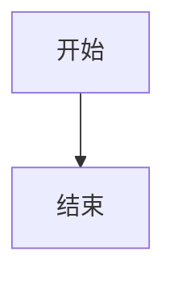
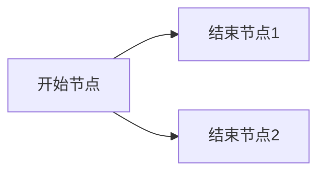

用记事本打开该文件，就可以看到对应的语法

# 一级标题

## 二级标题

### 三级标题

#### 四级标题

##### 五级标题

###### 六级标题

正文

---

# 文字式样

我是一个星号实现的*倾斜*

我是两个星号实现的**加粗**

我是三个星号实现的***斜体加粗***

我是一个下划线实现的 _倾斜_ 注意横线要与内容分开，不然就成普通连字符号了

我是两个下划线实现的 __加粗__

我是三个下划线实现的 ___斜体加粗___

我是两个等于号实现的===高亮===
我是三个等于号实现的==高亮==

我是~~删除~~

---

# 列表

1. 有序列表1
2. 有序列表2
	1. 按ab缩进有序列表
	2. 按ab缩进有序列表
3. 有序列表3

- 无序列表，减号实现
- 无序列表b
	- 按tab缩进无序列表
	- 按tab缩进无序列表
- 无序列表c

+ 无序列表，加号实现
+ 无序列表b

* 无序列表，星号实现
* 无序列表b

# 引用

> 我是引用
> 引用和**加粗**一起使用
> 引用和~~删除~~一起使用
> 下面是一个空白行
> 
> > 引用嵌套1
> > > 引用嵌套2
> > > > 引用嵌套3

> 1. 引用嵌套列表1
> 2. 引用嵌套列表2
> 
> - 引用嵌套无序列表
> - 引用嵌套无序列表

> NOTE:
> 
> 1. 提示
> 2. 提示

---
# 表情

可以使用windowns自带的表情（`win + .`）

😄 😆 😵 😭 😰 😅  😢 😤 😍 😌
👍 👎 💯 👏 🔔 🎁 ❓ 💣 ❤️ ☕️ 🌀 🙇 💋 🙏 💢
# 分割线

用三个"-"或者三个星号表示分割线，如下

---
***

# 超链接

## 链接

超级链接演示

[链接名字](https://www.baidu.com)

邮件：[username@gmail.com](mailto:username@gmail.com)

---

## 图片

图片演示


调整图片大小演示，实现代码如下，就是img标签加width，实现等比例缩放

```html

```


图注演示，实现代码如下

```html
<center> 
	
	<br>
	<div style="color:#999;">我是图注</div> 
</center>
```

<center> 
	
	<br>
	<div style="color:#999;">我是图注</div> 
</center>

---

## 其他链接表示

用大于小于号

<https://markdown.com.cn>

<fake@example.com>

## 格式化链接

跟加粗倾斜混合使用 [***百度***](www.baidu.com)

跟行内代码一起使用 [`GitHub`](github.com)

# 表格

表格演示，实现方式 ^12c878

```markdown
|左对齐|居中对齐|右对齐| 
|:----|:----:|---:|
|左|中|右|
```

具体演示：

|左对齐|居中对齐|右对齐| 
|:----|:----:|---:|
|左|中|右|
|你好|hello|こんにちは|

---

# 代码块

markdown中的代码演示 ^memo20230116205251

java代码

```java
public static void main(String[] args) {  
    System.out.println("Hello World");  
}
```

其他语法

```python
def max(a, b): 
	if a > b: 
		return a 
	else: 
		return b 

# 调用
a = 4 
b = 5 
print(max(a, b))
```

`行内代码块演示 docker ps -a`

---

# 特殊字符

特殊字符需要转义，用一个反斜杠实现

\\ 反斜线是特殊符号，也需要转移，所以两条斜线显示斜线  
\` 反引号  
\* 星号  
\_ 下划线  
\{\} 花括号   
\[\] 方括号   
\(\) 小括号   
\# 井字号   
\+ 加号   
\- 减号   
\. 英文句点   
\! 英文感叹号

---

# 其他

## 公式演示

> [Markdown语言——数学公式 - 知乎 (zhihu.com)](https://zhuanlan.zhihu.com/p/138532124)

行内公式演示

我是行内公式 $f(x) = 2x^2 + 3x + 4$

块间公式

$$
\frac{1}{2} + \dfrac{x}{y}
$$

---

## 任务列表

```text
语法如下，注意横杠和方括号之间有空格，方括号中间有空格，方括号和任务名之间有空格
- [ ] 未完成任务名
- [x] 已完成任务名
```

- [ ] 未完成任务名
- [x] 已完成任务名


---

## 页面跳转

1. 使用obsidian左边大纲跳转
2. 用链接跳过去

```markdown
格式：井号和名字中间没有空格
[点击跳转](#标题名)

例如：
[点击跳转](#表格)
[点击跳转](#引用)
```

[点击跳转到标题名是”列表“附近](#列表)

--- 

## 流程图

用的很少，不过多介绍，可以使用drawo.io代替





## 上下标

通过 `<sub>xx</sub>` 和 `<sup>xx</sup>` 标签来实现下标和上标

a<sup>2</sup> + b<sup>2</sup> = c<sup>2</sup>

CO<sub>2</sub>

# obsidian支持的其他语法

[[obsidian-markdown]]

# 更多语法

[帮助]([Editing and previewing Markdown - Obsidian Help](https://help.obsidian.md/Editing+and+formatting/Editing+and+previewing+Markdown))
